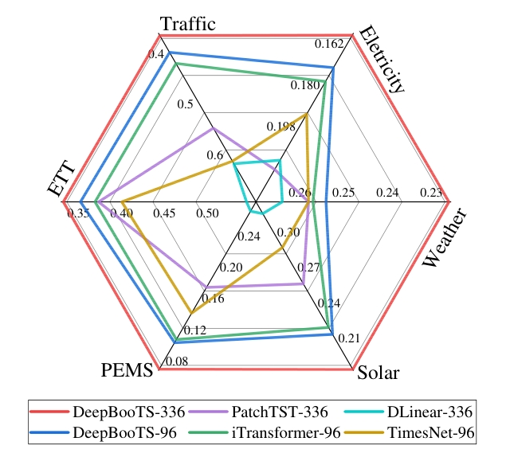
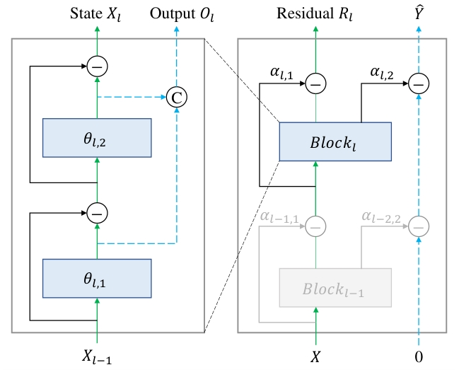
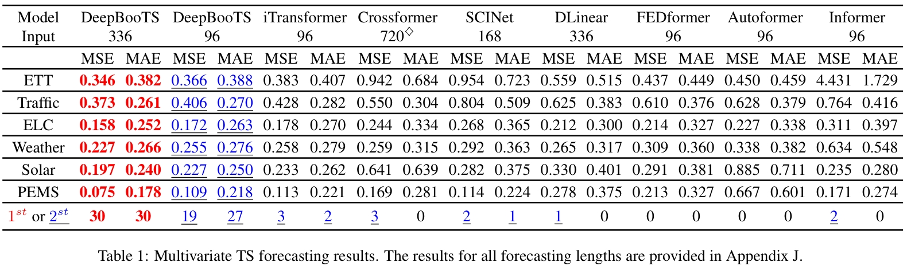
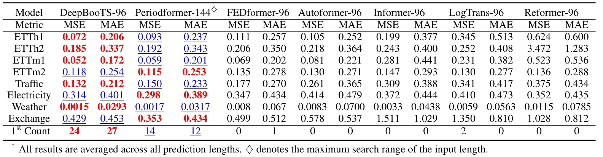
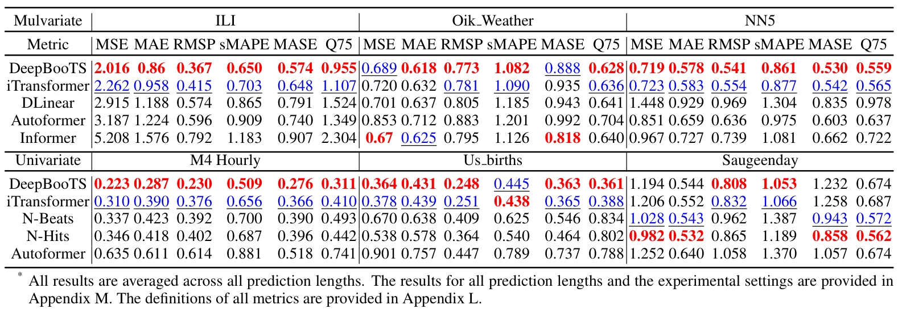
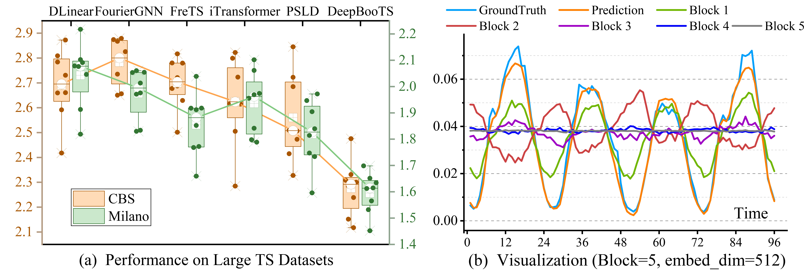
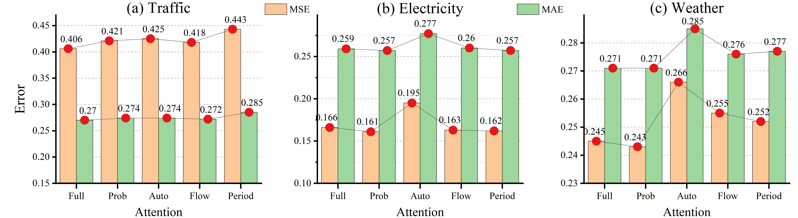
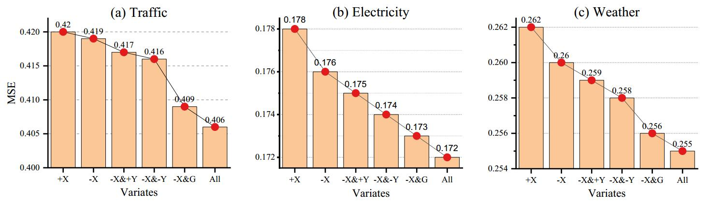
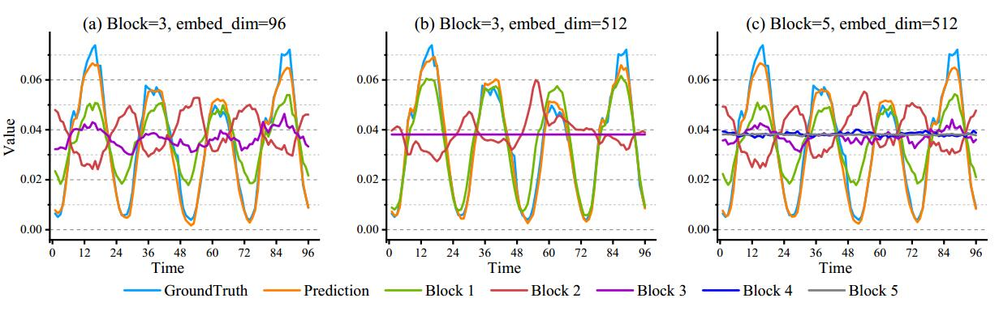
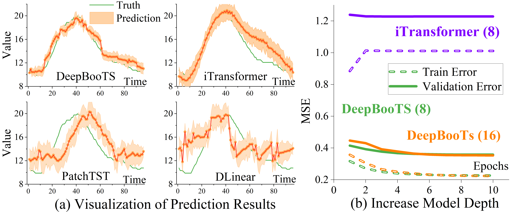

# DeepBooTS

## 1. Introduction

We analyse concept drift in time-series forecasting via bias-variance decomposition and introduce DeepBooTS, a dual-stream residual boosting architecture that reduces variance and dramatically improves forecast accuracy across diverse datasets. The key innovations are:
- We rigorously analyze concept drift through the lens of the bias-variance trade-off and prove that even simple deep ensembles can substantially reduce prediction variance without increasing bias.
- An efficient implementation of DeepBooTS is presented. Specifically, the outputs of subsequent blocks subtract the predictions of previous blocks, causing the network to explicitly model and reduce residual errors layer by layer. This residual‑learning mechanism is analogous to gradient boosting, but implemented within a deep network, enhancing robustness to distributional shifts.
- A dual‑stream decomposition is designed that decomposes both the input and labels, enabling the model to learn complementary representations while enhancing model versatility and interpretability. 
- Extensive experiments, including those on large-scale datasets, show that the proposed method outperforms existing state-of-the-art methods by a large margin, yielding an average performance improvement of 15.8% across various datasets. 

<div align=center></div>

## 2. Contributions

 - We investigate the impact of deep ensembles on overfitting from a bias-variance perspective, and rigorously demonstrate that even simple ensemble methods are capable of reducing model variance while conserving bias. 
 - The proposed DeepBooTS facilitates the learning-driven implicit progressive decomposition of the input and output streams, empowering the model with heightened versatility, interpretability, and resilience against overfitting.
 - DeepBooTS outperform existing state-of-the-art methods, yielding an average performance improvement of **11.9%** across various datasets.

<div align=center></div>

## 3. Training and Testing DeepBooTS
### 1) Dataset 
The datasets can be obtained from [Google Drive](https://drive.google.com/file/d/1l51QsKvQPcqILT3DwfjCgx8Dsg2rpjot/view?usp=drive_link) or [Tsinghua Cloud](https://cloud.tsinghua.edu.cn/f/2ea5ca3d621e4e5ba36a/).

### 2) Training on Time Series Dataset
Go to the directory "DeepBooTS/CommanTimeSeriesDatasets", we'll find that the bash scripts are all in the 'scripts' folder, like this:

```
scripts/
├── Electricity
│   ├── DeepBooTS_Autoformer_96M.sh
│   ├── DeepBooTS_Flowformer_96M.sh
│   ├── DeepBooTS_336M.sh
│   ├── DeepBooTS_96M.sh
│   ├── DeepBooTS_96S.sh
│   ├── DeepBooTS_Informer_96M.sh
│   └── DeepBooTS_Periodformer_96M.sh
├── ETTh1
│   ├── DeepBooTS_ETTh1_336M.sh
│   ├── DeepBooTS_ETTh1_96M.sh
│   └── DeepBooTS_ETTh1_96S.sh
├── ETTh2
│   ├── DeepBooTS_ETTh2_336M.sh
│   ├── DeepBooTS_ETTh2_96M.sh
│   └── DeepBooTS_ETTh2_96S.sh
├── ETTm1
│   ├── DeepBooTS_ETTm1_336M.sh
│   ├── DeepBooTS_ETTm1_96M.sh
│   └── DeepBooTS_ETTm1_96S.sh
├── ETTm2
│   ├── DeepBooTS_ETTm2_336M.sh
│   ├── DeepBooTS_ETTm2_96M.sh
│   └── DeepBooTS_ETTm2_96S.sh
├── Exchange
│   └── DeepBooTS_96S.sh
├── Pems
│   ├── DeepBooTS_336M.sh
│   └── DeepBooTS_96M.sh
├── SolarEnergy
│   ├── DeepBooTS_Autoformer_96M.sh
│   ├── DeepBooTS_Flowformer_96M.sh
│   ├── DeepBooTS_336M.sh
│   ├── DeepBooTS_96M.sh
│   ├── DeepBooTS_Informer_96M.sh
│   └── DeepBooTS_Periodformer_96M.sh
├── Traffic
│   ├── DeepBooTS_Autoformer_96M.sh
│   ├── DeepBooTS_Flowformer_96M.sh
│   ├── DeepBooTS_336M.sh
│   ├── DeepBooTS_96M.sh
│   ├── DeepBooTS_96S.sh
│   ├── DeepBooTS_Informer_96M.sh
│   └── DeepBooTS_Periodformer_96M.sh
└── Weather
    ├── DeepBooTS_Autoformer_96M.sh
    ├── DeepBooTS_Flowformer_96M.sh
    ├── DeepBooTS_336M.sh
    ├── DeepBooTS_96M.sh
    ├── DeepBooTS_96S.sh
    ├── DeepBooTS_Informer_96M.sh
    └── DeepBooTS_Periodformer_96M.sh    
```

Then, you can run the bash script like this:
```shell
    bash scripts/Electricity/DeepBooTS-96M.sh
```


### 4) Training on Large-Scale Time Series Dataset

**Download the Dataset**: The datasets can be obtained from [Google Drive](https://drive.google.com/drive/folders/1ClfRmgmTo8MRlutAEZyaTi5wwuyIhs4k?usp=sharing).

Go to the directory "DeepBooTS/LargeScaleTimeSeriesDatasets", we'll find that the bash script is in the 'scripts' folder, then run the:

```shell
    bash scripts/run_large_offline_milano.sh
```

Note that:
- Model was trained with Python 3.10 with CUDA 12.4.
- Model should work as expected with pytorch >= 1.12 support was recently included.

## 4. Performace on Multivariate Time Series

DeepBooTS achieves the consistent SOTA performance across all datasets and prediction length configurations.

<div align=center></div>

## 5. Performace on Univariate Time Series

DeepBooTS continues to maintain a SOTA performance across various prediction length settings compared to the benchmarks.

<div align=center></div>


## 6. On Monash TS Datasets

we evaluate the proposed method on 7 Monash TS datasets (e.g., NN5, M4 and Sunspot, etc.) and 7 diverse metrics (e.g., MAPE, sMAPE, MASE and Quantile, etc.) to systematically evaluate our model. All experiments are compared under the same input length (e.g., I=96) and output lengths (e.g., O={96, 192, 336 and 720}). As shown in Table 3, the proposed DeepBooTS emerged as the frontrunner, achieving a score of 41 out of 54. 

<div align=center></div>


## 7. On Large Time Series Datasets 

The performance comparisons for large-scale TS datasets. For details on the large-scale TS datasets, including the CBS dataset with 4,454 nodes (17GB) and the Milano dataset with 10,000 nodes (19GB). Compared to the latest advanced PSLD, the proposed DeepBooTS yields an overall {\bf 8.9\%} and {\bf 6.2\%} MSE reduction on the CBS and Milano datasets, respectively.
<div align=center></div>


## 8. Good Generality

Ablation Studies of DeepBooTS with Various Attention. All results are averaged across all prediction lengths. The tick labels of the X-axis are the abbreviation of Attention types.

<div align=center></div>


## 9. Very Effectiveness

Ablation studies on various components of DeepBooTS. All results are averaged across all prediction lengths. The variables X and Y represent the input and output streams, while the signs ‘+' and ‘-' denote the addition or subtraction operations used when the streams' aggregation. The letter ‘G' denotes adding a gating mechanism to the output of each block.

<div align=center></div>


## 10. Good Interpretability

Visualization depicting the output of each block in DeepBooTS. The experiment was implemented on the Traffic dataset using the setting of Input-96-Predict-96. The utilized models have the same hyperparameter settings and similar performance.

<div align=center></div>


## 11. Reduce Variance Go Deeper

DeepBooTS achieves superior performance and the smallest prediction variance, while other models exhibit weaker alignment with ground truth and higher variance.

Given the DeepBooTS's robustness against overfitting, it can be designed with considerable depth. Even with the DeepBooTS blocks deepened to 8 or 16, it continues to exhibit excellent performance.

<div align=center></div>

